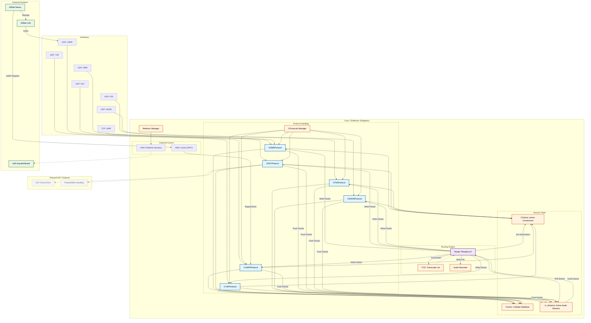
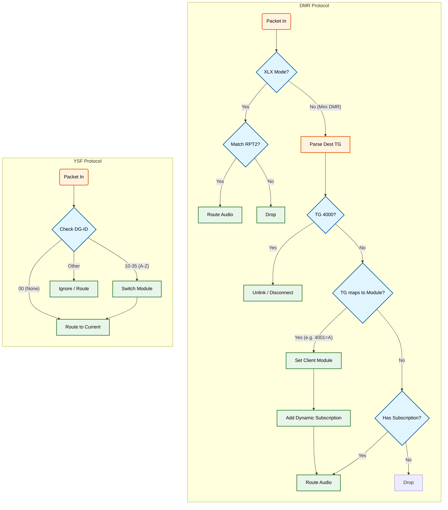
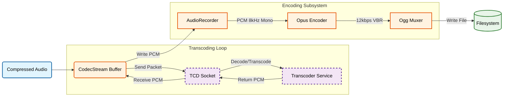
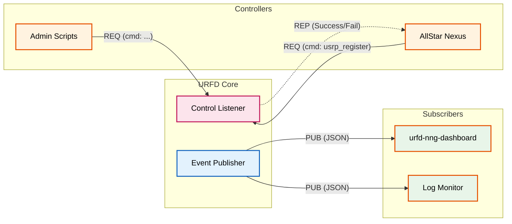

# URFD Architecture Reference

This document provides a high-level overview of the `urfd` (Universal Reflector) internal architecture and data flow.

## System Overview

`urfd` is a multi-protocol digital voice reflector. It accepts connections from various amateur radio protocols (D-Star/USRP, DMR, YSF, M17, etc.), normalizes the audio streams, and redistributes them to connected clients based on "Modules" (A-Z).

### Core Components Diagram



## Data Flow Description

1. **Ingestion (Protocol Threads)**
    * Each protocol (USRP, YSF, etc.) spawns a dedicated listening thread (or uses `select`/`poll` on sockets).
    * **Packet Handling**: Incoming UDP packets are validated.
    * **Session**: If it's a new connection (or "Key Up"), the protocol creates or looks up a `CClient` object in `CClients`.
    * **Streaming**: Valid audio frames are wrapped in a generic `CPacket` and pushed into a `CPacketStream` (associated with a specific Stream ID and Module).

2. **Routing (Router Threads)**
    * `urfd` spawns one **Router Thread** per Module (A through Z).
    * **Aggregation**: The thread checks all active `CPacketStream`s assigned to its module.
    * **Mixing/Selection**: It selects the active speaker (usually "first in" wins, locking out others until silence).
    * **Transcoding**: If the source and destination codecs differ (e.g., M17 3200 vs DMR AMBE), the **`TCD`** library is invoked to convert the audio payload.
    * **Recording**: The active stream is optionally written to disk by the **`AudioRecorder`**.
    * **Distribution**: The selected audio packet is sent to `CClients` to find all clients currently listening on that module.
    * **Output**: The packet is passed back to the appropriate Protocol handler to be encoded (if necessary) and sent over the network to each listener.

3. **State Management**
    * **CClients**: Maintains the list of connected nodes/repeaters, their IP addresses, protocols, and current Module selection.
    * **CUsers**: Tracks unique callsigns heard, often used for "Last Heard" lists and dashboards.

4. **Inter-Process Communication (NNG)**
    * **PUB (Publisher)**: `urfd` publishes events (e.g., `HEARING` payload with Callsign/Module) to a local socket. **`urfd-nng-dashboard`** subscribes to this to show real-time activity.
    * **REP (Replier)**: Accepts RPC commands to modify state. Used by **`AllStar Nexus`** to register USRP clients dynamically (IP-to-Callsign mapping) and manage connections.

## Class Responsibilities

* `CReflector`: The main application class. Initializes subsystems and owns the global state.
* `CProtocol`: Base class for all network protocols. Handles socket I/O.
* `CClient`: Represents a connected node. Stores state like "Is Transmitting?", "Current Module", "IP Address".
* `CPacketStream`: A jitter buffer/queue for incoming audio from a single source.
* `CNNGPublisher`: Serializes events to JSON and broadcasts them.
* `CNNGControl`: Handles incoming RPC commands (e.g., `usrp_register`).
* `TCD`: Wrapper for the Transcoder library, handling codec conversion.
* `AudioRecorder`: Manages writing audio streams to WAV/files.

## Future Plans

* **M17 Enhancements**:
  * **Parrot Echo**: Native echo functionality for M17 streams (currently missing).
  * **Packet/SMS**: Support for M17 data frames and text messaging.

## Module Switching & Control Logic

`urfd` supports dynamic module switching via protocol-specific metadata (DMR Talkgroups, YSF DG-ID, etc.). This allows users to change rooms/modules from their radio without a dashboard.

### DMR & YSF Logic Flow



## Audio Recording Flow

`urfd` includes an automated recording subsystem that archives active voice streams to disk.

### Architecture

Recording is tightly integrated with the **Transcoder (TCD)** pipeline. Because most digital voice modes (DMR, YSF, M17) use compressed codecs (AMBE, Codec2), the audio must first be **decoded to PCM** before it can be mixed or recorded.



### Storage Format

Recordings are saved in **Ogg Opus** format, optimized for voice storage efficiency.

* **Codec**: Opus (VOIP profile)
* **Sample Rate**: 8kHz (Narrowband)
* **Channels**: Mono
* **Bitrate**: 12kbps (Variable Bitrate)
* **Frame Size**: 60ms

### Storage Requirements

Due to the high efficiency of Opus for speech, the storage footprint is minimal:

| Duration | Approx Size |
| :--- | :--- |
| **1 Minute** | ~90 KB |
| **1 Hour** | ~5.4 MB |
| **24 Hours** | ~130 MB |

Files are named using **UUIDv7**, ensuring they are unique and time-sortable (e.g., `hearing_01944e45-d8dc-7ce0-98cc-260538058721.opus`).

## NNG Event & Control System

`urfd` uses NNG (nanomsg) for high-performance Inter-Process Communication (IPC). This provides a loosely coupled integration point for dashboards, external controllers, and other services.

### Architecture Diagram



### Published Events (PUB)

The core publishes JSON events to the configured socket (default `ipc:///tmp/urfd_events`).

#### Hearing Event

Sent when a client transmits (Key Up).

```json
{
  "type": "hearing",
  "my": "N7TAE",
  "ur": "CQCQCQ",
  "rpt1": "RPT1",
  "rpt2": "RPT2",
  "module": "A",
  "protocol": "YSF"
}
```

#### Closing Event

Sent when a transmission ends (Key Down). Can include a recording path.

```json
{
  "type": "closing",
  "my": "N7TAE",
  "module": "A",
  "protocol": "YSF",
  "recording": "/var/log/urfd/recordings/hearing_... .opus"
}
```

#### Client Connection Events

Sent when a node connects or disconnects.

```json
{
  "type": "client_connect",
  "callsign": "W1AW-B",
  "ip": "203.0.113.45",
  "protocol": "DMR",
  "module": "B"
}
```

*(Similarly `client_disconnect` follows the same structure)*

#### Periodic State

Sent periodically (approx every 10s) containing the full reflector state (active usage, stats).

```json
{
  "type": "state",
  "clients": [...],
  "lastheard": [...]
}
```

### Control Commands (RPC/REP)

The core listens for JSON commands on a separate socket (default `ipc:///tmp/urfd_control`).

#### Register USRP Client

Used by external systems (like AllStar Nexus) to dynamically map an IP address to a callsign, allowing valid transmission without static config.

**Request:**

```json
{
  "cmd": "usrp_register",
  "ip": "203.0.113.10",
  "callsign": "W1AW"
}
```

**Response:**

```json
{
  "status": "ok",
  "message": "registered"
}
```
