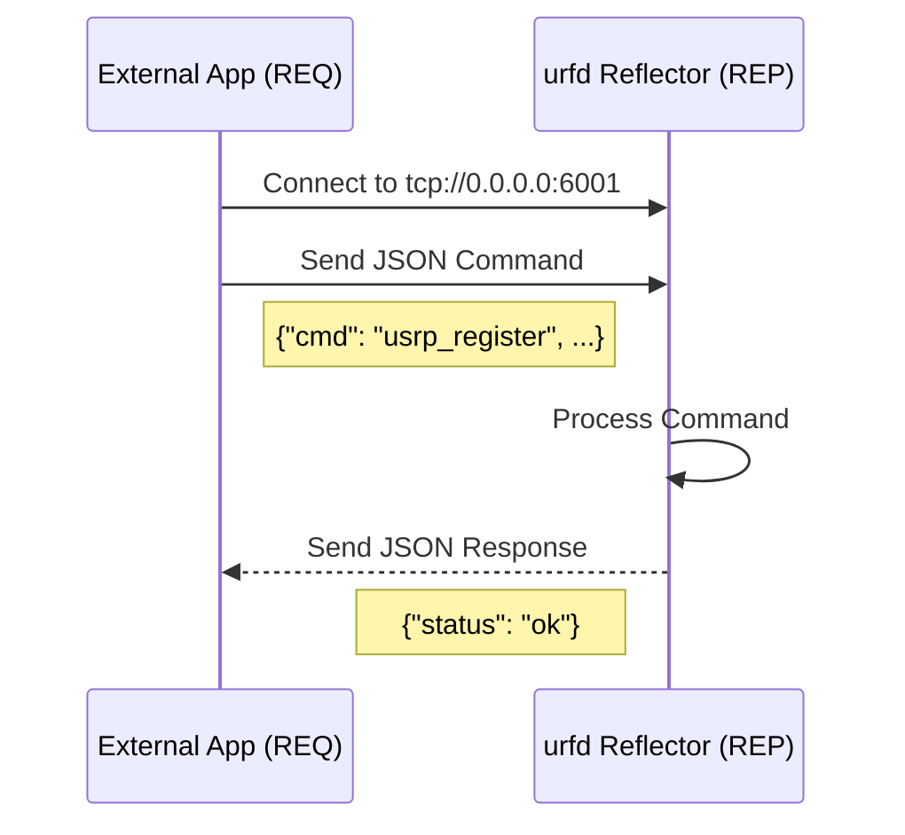
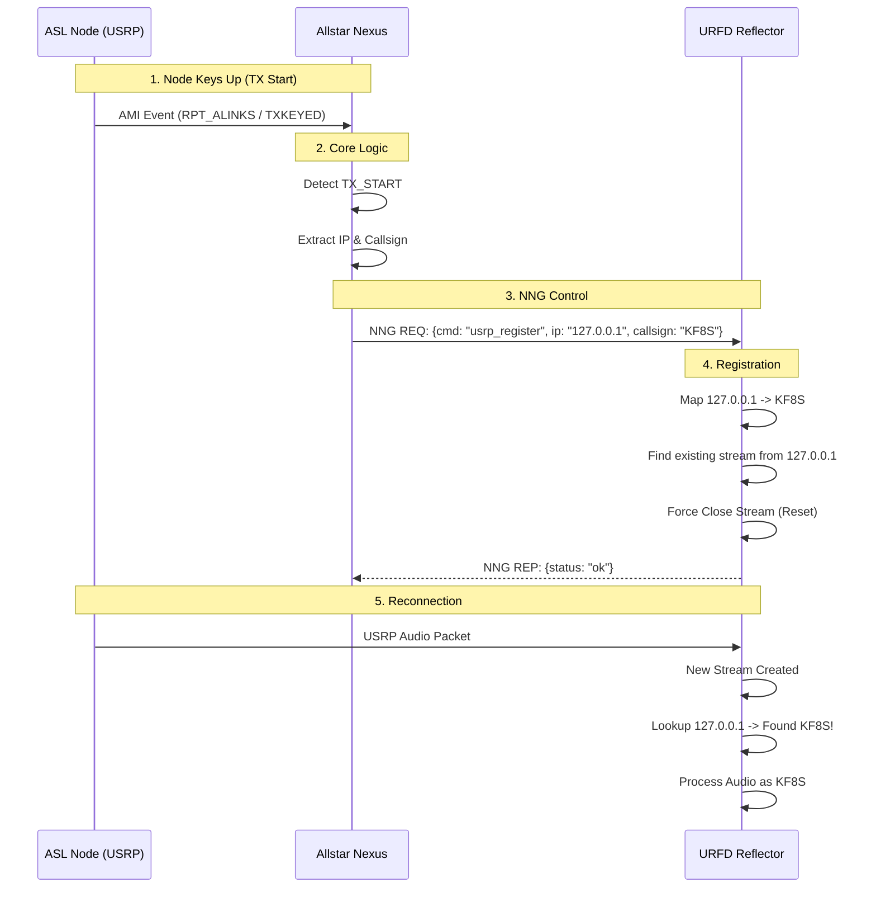

# NNG Control Channel Documentation

This document describes the NNG Control Channel in `urfd`, a mechanism for external applications (like `allstar-nexus` or a dashboard) to send commands to the reflector.

Unlike the [Event System](nng.md) which uses a **PUB/SUB** (Publish/Subscribe) pattern for one-way status updates, the Control Channel uses a **REQ/REP** (Request/Reply) pattern to execute commands and receive immediate feedback.

## Architecture

The `urfd` reflector acts as an NNG **Replier** (REP). External applications connect as **Requesters** (REQ) to send JSON-formatted commands.



## Configuration

To enable the control channel, update your `urfd.ini` (or `config.ini`) in the `[Dashboard]` section:

```ini
[Dashboard]
; Enable the NNG Control Channel
ControlNNGEnable=true

; Bind address for the NNG REP socket
ControlNNGAddr=tcp://0.0.0.0:6001
```

## Commands

### 1. Register USRP Client (`usrp_register`)

Dynamically maps an IP address to a Callsign for USRP connections. This is useful for systems like AllStarLink where the incoming IP is known but the reflector protocol (USRP) does not natively carry the callsign in the header, or the header is not compliant.

**Request:**

```json
{
  "cmd": "usrp_register",
  "ip": "1.2.3.4",
  "callsign": "W1AW"
}
```

**Response (Success):**

```json
{
  "status": "ok",
  "message": "registered"
}
```

**Response (Error):**

```json
{
  "status": "error",
  "message": "missing ip or callsign" 
}
```

**Behavior:**

1. `urfd` updates its internal IP-to-Callsign map.
2. `urfd` **force-closes** any active USRP streams from that IP address.
3. The client (e.g. AllStar node) automatically reconnects (sends next packet).
4. `urfd` accepts the new connection, looks up the IP in the map, finds the new callsign, and attributes the stream to it.

## Integration Example (Mermaid)

The following diagram illustrates the flow when integrating with `allstar-nexus`:


